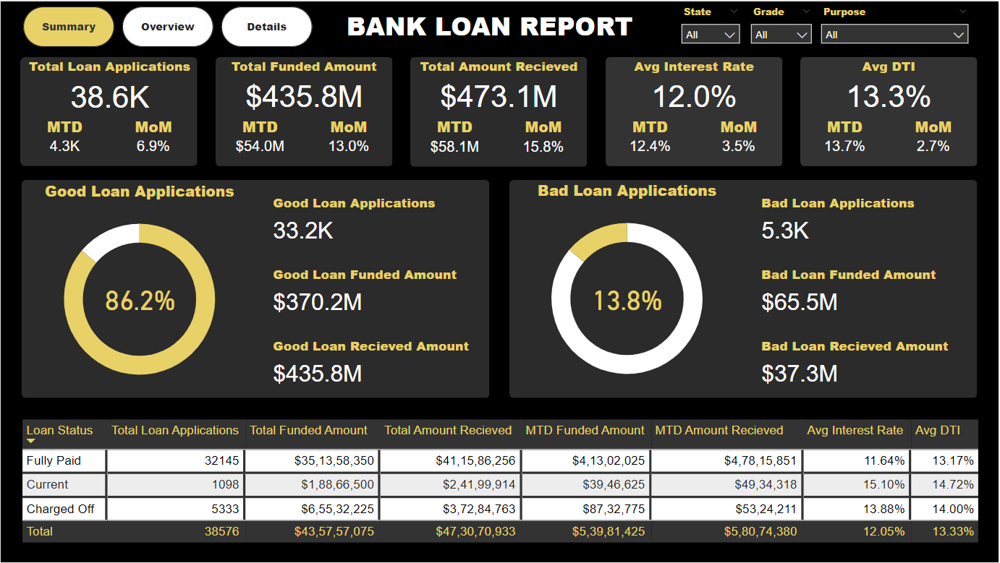
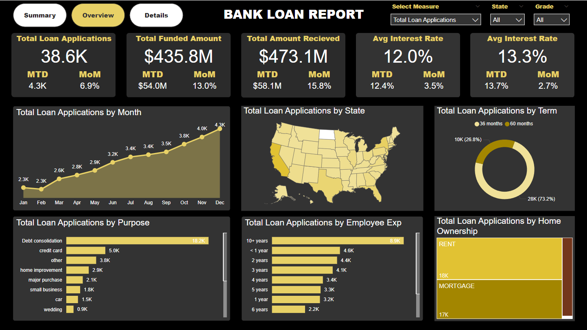
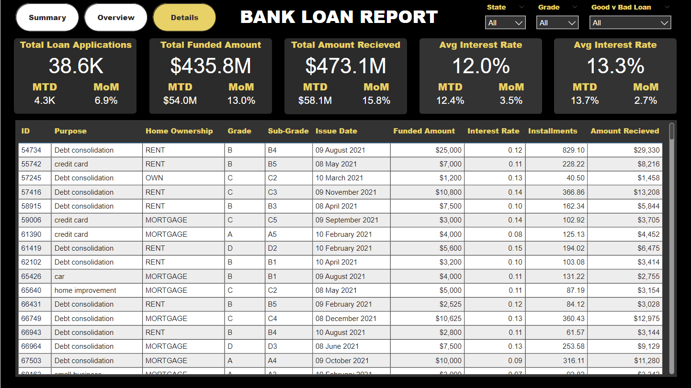
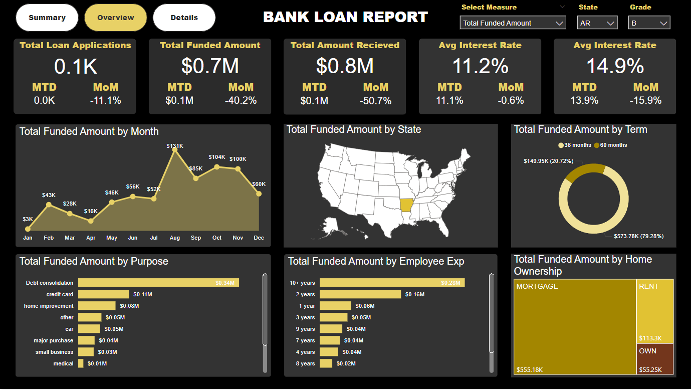

# PowerBI project

## Dashboard 1: Summary


## Dashboard 2: Overview


## Dashboard 3: Details


## Slicers Implementation
- Overview of `Total Funded Amount` for Loan of Grade `B` in State `AR`


---

## DAX Queries Used

```bash
Total Loan Applications = COUNT(bank_loan_data[id])
MTD Loan Applications = CALCULATE(TOTALMTD([Total Loan Applications], 'Date Table'[Date]))
MoM Loan Applications = 
    VAR PMTD = 
        CALCULATE([Total Loan Applications], DATESMTD(DATEADD('Date Table'[Date], -1, MONTH)))
    VAR MTD = 
        [MTD Loan Applications]
    RETURN 
        (MTD - PMTD) / PMTD
    

Total Funded Amount = SUM(bank_loan_data[loan_amount])
MTD Funded Amount = CALCULATE(TOTALMTD([Total Funded Amount], 'Date Table'[Date]))
MoM Funded Amount = 
    VAR PMTD = 
        CALCULATE([Total Funded Amount], DATESMTD(DATEADD('Date Table'[Date], -1, MONTH)))
    VAR MTD = 
        [MTD Funded Amount]
    RETURN 
        (MTD - PMTD) / PMTD

Total Amount Recieved = SUM(bank_loan_data[total_payment])
MTD Amount Recieved = CALCULATE(TOTALMTD([Total Amount Recieved], 'Date Table'[Date]))
MoM Amount Recieved = 
    VAR PMTD = 
        CALCULATE([Total Amount Recieved], DATESMTD(DATEADD('Date Table'[Date], -1, MONTH)))
    VAR MTD = 
        [MTD Amount Recieved]
    RETURN 
        (MTD - PMTD) / PMTD

Avg Interest Rate = AVERAGE(bank_loan_data[int_rate])
MTD Avg Interest Rate = CALCULATE(TOTALMTD([Avg Interest Rate], 'Date Table'[Date]))
MoM Avg Interest Rate = 
    VAR PMTD = 
        CALCULATE([Avg Interest Rate], DATESMTD(DATEADD('Date Table'[Date], -1, MONTH)))
    VAR MTD = 
        [MTD Avg Interest Rate]
    RETURN 
        (MTD - PMTD) / PMTD

Avg DTI = AVERAGE(bank_loan_data[dti])
MTD Average DTI = CALCULATE(TOTALMTD([Avg DTI], 'Date Table'[Date]))
MoM Average DTI = 
    VAR PMTD = 
        CALCULATE([Avg DTI], DATESMTD(DATEADD('Date Table'[Date], -1, MONTH)))
    VAR MTD = 
        [MTD Average DTI]
    RETURN 
        (MTD - PMTD) / PMTD

Good Loan % = (CALCULATE([Total Loan Applications],bank_loan_data[Good v Bad Loan] = "Good Loan")) / [Total Loan Applications]
Good Loan Applications = CALCULATE([Total Loan Applications],bank_loan_data[Good v Bad Loan]="Good Loan")
Good Loan Funded Amount = CALCULATE([Total Funded Amount],bank_loan_data[Good v Bad Loan]="Good Loan")
Good Loan Recieved Amount = CALCULATE([Total Amount Recieved],bank_loan_data[Good v Bad Loan]="Good Loan")

Bad Loan % = (CALCULATE([Total Loan Applications],bank_loan_data[Good v Bad Loan] = "Bad Loan")) / [Total Loan Applications]
Bad Loan Applications = CALCULATE([Total Loan Applications],bank_loan_data[Good v Bad Loan]="Bad Loan")
Bad Loan Funded Amount = CALCULATE([Total Funded Amount],bank_loan_data[Good v Bad Loan]="Bad Loan")
Bad Loan Recieved Amount = CALCULATE([Total Amount Recieved],bank_loan_data[Good v Bad Loan]="Bad Loan")
```

